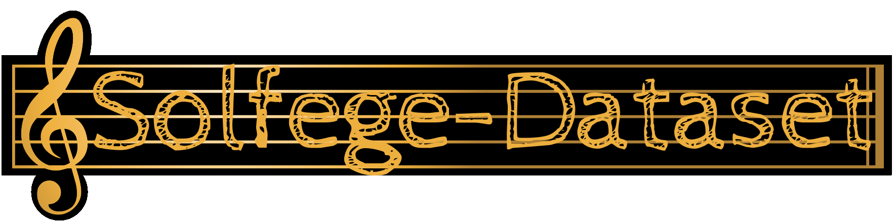

<!-- Title -->

Solfege is a music education method used to teach aural skills, pitch and sight-reading of Western music. Solfege is a form of solmization, and though the two terms are sometimes used interchangeably. The Solfege-Dataset was created to support the developent of computer music aplications. This dataset is composed with different song pieces. 
######  The Solfege-Dataset is divided in:
- [X] **`.wav` Data**
- [x] **`MIDI` Data**
- [x] **`MusicXML` Scores**
- [X] **Tunning**

The songs in `.wav` have all the representations checked in the checkboxes.

###### The repertore data is divided as:
- 🎼 **Alexis de Garaude**: Featuring three instruments with different timbres, Solfege lessons by [Alexis de Garaudé](https://www.vitale.com.br/sistema/produtos/produto.asp?codigo=10147) were recorded. For each instrument the Alexis de Garaude data have:
  - [X] Real Noise (with 3 noise levels. 100 lessons for each noise)
  - [X] Artificial Noise (with 3 noise levels. 100 lessons for each noise)
  - [X] Pure (100 lessons of each.)
  - [X] Segmented notes
  
- 🧐 **Classical**: Classical music is art music produced or rooted in the traditions of Western culture, including both liturgical (religious) and secular music.
- 🎤 **Folk Traditional**: includes traditional folk music and the genre that evolved from it during the 20th-century folk revival. Some types of folk music may be called world music. Traditional folk music has been defined in several ways: as music transmitted orally, music with unknown composers, or music performed by custom over a long period of time. 
- 👾 **Geek Themes**: is the overall category of music collecting the musical genres that grew from nerd culture; different styles that share the same common ground.
- 🍾 **Holiday Patriotic**: songs for a day that is a celebration of something special.
- 🚩 **Rounds**: is a musical composition in which a minimum of three voices sing exactly the same melody at the unison (and may continue repeating it indefinitely), but with each voice beginning at different times so that different parts of the melody coincide in the different voices, but nevertheless fit harmoniously together. It is one of the easiest forms of part singing, as only one line of melody need be learned by all parts, and is part of a popular musical tradition.

The `.wav` data was recorded in a controled ambient and it uses acustic instruments. It covers exercises capable of combining different musical tempos, and different measures. The work will contribute to the development of computer music since the vast majority of the available data bases are synthetic.

 The acustic instruments available:
- 🎹 Piano; 
- 🎷 Saxofone alto;
-   Sweet Flute.

The recordings were made by in a controlled environment, using the wave format with stereo audio. The songs were recorded using open software called [Weeny Free Audio Recorder](https://weeny-free-audio-recorder.software.informer.com/1.3/).

In addition to every `.wav` format, can be found the correspondent score which is in  [MusicXML](https://www.musicxml.com/) format. These `MusicXML` files were generated from a program called [Musescore](https://musescore.com/) is also free software that has great acceptance by musicians.

<!-- ### Data Processing -->
### More Information
A first presentation about this dataset was given at [Facon Tech Week 2014](http://livrozilla.com/doc/1531346/programa%C3%A7%C3%A3o-detalhada) and can be downloaded here. Furthermore, there is information about labs using this dataset and related publications in the repository wiki. Please contact us, if you would like to be added.

### Contributing 
You are openly invited to contribute to this dataset. There are several possibilities to do this:
- add more subjects by running the experiment yourself
- host an http download mirror or seed the dataset torrent to provide download bandwidth
- run your own experiments on the dataset and share your results
- ...

### Acknowledgments
This dataset is a result of ongoing joint work between an Undergraduated Research of the [Federal University of Uberlândia](http://www.ufu.br/) [(UFU)](http://www.ufu.br/). It has been supported by [Fundação de Amparo à Pesquisa do Estado de Minas Gerais](https://fapemig.br/pt/) [FAPEMIG](https://fapemig.br/pt/)

<!-- ### References -->

<!-- The chosen songs encompass a large part of music theory, enabling a more complete training for automatic music transcription systems. Algorithms were generated to extract elements from the scores in `MusicXML` such as extracting notes, scale, key signature, and accidents, which are the various elements that make up a score. For the purpose of validating automatic music transcription systems, all three hundred songs had each of their notes manually segmented. Figure 1 exemplifies the manual segmentation process for notes. Therefore, each song is divided into a sequence of $N$ individual notes. In addition to the `.wav` file containing only the note, a label is also provided that specifies which note it corresponds to.

Such a basis allows researchers to validate and train their supervised and unsupervised classification methods in a systematic and detailed manner. Due to the groundtruths produced manually the base is completely characterized. This music bank will be public for the use of all interested researchers as a common basis for research. In particular, it provides a range of music ranging from simple exercises like scales to more complex exercises involving semiquaver triplets. Containing different structures of tempo and measure, melody, including a wide application of the musical concepts that are taught in conservatories. -->

